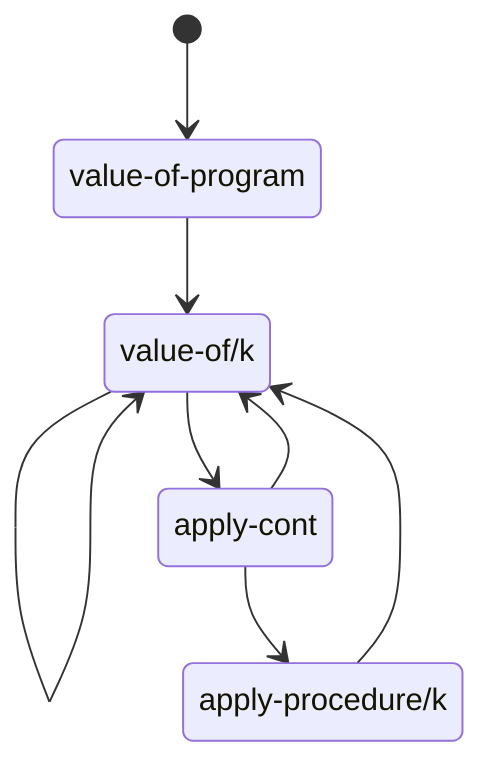

# EOPL

书籍《Essentials of Programming Language》使用 Scheme 实现了类似 Lisp 的语言用来解释语言设计中的一些核心概念。

本仓库使用 Racket 重新实现相关代码，Racket 有现成的库提供了 [EOPL](https://docs.racket-lang.org/eopl/index.html) 中使用的语法形式和函数。

使用 raco 命令安装 [EOPL 库](https://github.com/racket/eopl)，并在.rkt 文件第一行使用 `#lang eopl`开启这个模式。

```rkt
#lang eopl
```

EOPL 中使用 Scheme 的函数`identifier?`判断一个值是不是标识符，Racket 没有提供这个函数，但是有类似`symbol?`来判断一个值是不是符号，区别参考这个[问题](https://stackoverflow.com/questions/48393025/difference-between-an-identifier-and-symbol-in-scheme)。

## TODO:

- proc-lang free-variables optimization
  - [ ] exer 3.26/3.42 free-variables
  - [ ] fixed point exer 3.23/3.24/3.25
- chapter 5.1
  - [ ] Exercise 5.16 在 Exercise 4.22 的基础上，实现 CPS 解释器。

## Chapter 3 Expressions

source language/defined language 指要设计和实现的语言。
implementation language/defining language 指编写源码使用的语言。
expressed values 指原语言中可能的表达式值类型
denoted values 指实现语言中用来表示 expressed values 的值

在对源语言进行解释执行的过程中，要识别 expressed values 的类型，然后映射到 denoted values，在实现语言中对 denoted values 进行
相应的运算，然后将运算结果包装为对应的 expressed values，映射回源语言。

$n$ 是 denoted value，$\lceil n \rceil$ 代表 expressed value 中对应的值。

$n$ 是 expressed value，$\lfloor n \rfloor$ 代表 denoted value 中对应的值。

### let-lang

**let 语句** 定义的若干个变量中，前边的变量对后续变量的初始化语句不可见，变量初始化语句不能使用 let 中定义的变量，只能使用外层变量。

```rkt
let x = 30
    in let x = -(x,1)
           y = -(x,2)
        in -(x,y)
```

`y = -(x,1)`中的`x`是外层的`x`，所以结果是`1`。

**`let*`**语句定义的若干个变量中，前边的变量对后续变量的初始化语句可见。

```rkt
let x = 30
    in let* x = -(x,1)
            y = -(x,2)
        in -(x,y)
```

`y = -(x,1)`中的`x`是内层的`x`，所以结果是`1`。

**unpack**类似于 ES 6 的解构，将一个列表中的元素绑定绑定到多个变量上。

```
let u = 7
    in unpack x y = cons(u,cons(3,emptylist))
        in -(x,y)
```

计算结果是`4`。

### proc-lang

### letrec lang

#### env-list rep

letrec-lang 中环境使用 list 实现，参考标签: letrec-lang-env-list-env.

### lexical addressing

词法作用规则下，变量使用处与定义处相隔的环境层数与代码结构对应，这个偏移量在运行前就确定了。因此可以提前计算，并将变量使用处名称替换为
偏移量，这样就避免了在运行时再去逐层查找变量，可以变量查找从线性时间优化为常量时间。

最基本的情况中，每层环境（Environment）只定义一个变量数据，变量的就可以替换为一个非负整数偏移量，0 表示当前层环境；如果每层环境（Environment）
可以定义多个变量数据，那么变量可以由一个非负整数对定义`(env, offset)`，`env`代表环境的偏移量，`offset`表示环境中单个变量的偏移量。

为了实现 lexical addressing，需要对解释器进行改造，拆分为两个步骤。

第一步翻译，将源代码分析一遍，将涉及到的变量定义与使用的表达式类型`E`转换为一个新的对应类型表达式类型`E1`。`E`中的变量引用在`E1`中被替换为偏移量数据，`E`中的变量定义名称信息在`E1`中可以不再记录，因为在运行时已经不需要名称信息再去定位变量了。

第二步改造解释器，解释器中去除对于旧类型`E`的支持，因为翻译的过程中所有表达式类型`E`都被转换处理，结果中没有这种类型了；增加对于新类型`E1`的支持，`E1`的运行结果应该和旧解释其中`E`一致。

具体涉及到的修改：

1. 定义 static-env 在转换过程中用来计算变量偏移量。
1. 运行时的 env 可以去除变量名称信息，只记录变量值。
1. 涉及到变量定义和使用的表达式类型`E`需要增加对应新类型`E1`，其他的表达式类型只需要递归转换即可。当前版本涉及的表达式类型如下:
   1. var-exp -> nameless-var-exp
   1. let-exp -> nameless-let-exp
   1. proc-exp -> nameless-proc-exp

#### letrec

exer 3.40 关于 letrec-exp 的处理

```
letrec p-name (b-var)
  = p-body
    in body
```

假设`p-name`函数之前的环境变量是`env`，那么 `p-body` 和 `body` 对应的环境变量分别如下。

```
body -> (p-name env)
p-body -> (b-var p-name env)
```

首先修改`environment`定义记录变量类型，这样能区分普通变量和`letrec-exp`定义的变量。

```scheme
(define (extend-senv type var senv)
  (cons (list type var) senv)
  )

(define (extend-senv-normal var senv)
  (extend-senv 'normal var senv)
)

(define (extend-senv-letrec var senv)
  (extend-senv 'letrec var senv)
)
```

然后可以根据变量类型将其转换为`nameless-var-exp`或者`nameless-letrec-var-exp`。

```scheme
(var-exp (var)
         ; new stuf
         (let* ([index (apply-senv senv var)] [type (car (list-ref senv index))])
          (cond
            [(eqv? type 'normal) (nameless-var-exp index)]
            [(eqv? type 'letrec) (nameless-letrec-var-exp index)]
            [else (eopl:error 'value-of-exp "unsupported var ~s of type ~s, only allow 'normal/letrec" var type)]
            )
          )
         )
```

将`letrec-exp`转换为`nameless-letrec-exp`，注意其中`body`所在的环境变量包含了`p-name`；`p-body`所在的环境同时包含了`p-name`和`b-var`。

```
(let ([proc-env (extend-senv-letrec p-name senv)])
  (nameless-letrec-exp
    ; both p-body and body remembers current senv in their env
    ; handle recursive variable behavior in interpreter logic
    (translation-of-exp p-body (extend-senv-normal b-var proc-env))
    (translation-of-exp body proc-env)
  )
)
```

然后在解释器部分处理关于递归变量`p-name`的访问，其中`nameless-letrec-exp`对应的新环境变量`new-env`需要在`env`的基础上新增一个
对应`p-name`的函数值`the-proc`，其中`(procedure p-body env)`中使用环境变量由于`letrec`表达式的递归语意，应该就是`new-env`本身，
但是这样形成了循环引用，在`letrec-lang`中我们使用了`extend-env-rec`来打破循环引用。同样的处理方式，在`procedure`中先使用`env`，
然后在变量访问逻辑中来处理`letrec`的递归语意。

```scheme
; new stuff
(nameless-letrec-exp (p-body body)
                      (let ([the-proc (proc-val (procedure p-body env))])
                      (value-of-exp body (extend-nameless-env the-proc env))
                      )
                     )
```

访问`nameless-letrec-var-exp`代表的递归变量`p-name`时，同样应该返回一个`procedure`，它的`body`保存在`p-name`对应的值中。
`letrec`的递归语意要求这个`procedure`对应的环境变量应该包含`p-name`，从当前的环境量`env`中找到以`p-name`开头的尾部环境变量，
就是需要的部分。

```scheme
(nameless-letrec-var-exp (num)
                          ; list-tail find tail part of list starting from target element
                          (let ([new-nameless-env (list-tail env num)])
                          ; so car of new-nameless-env is the-proc corresponding to letrec-var
                          (let ([the-proc (expval->proc (car new-nameless-env))])
                            ; cases requires to "procedure.rkt" to load eagerly
                            (cases proc the-proc
                              (procedure (body saved-env)
                                ; environment of procedure body is new-nameless-env with first var being
                                ; the-proc itself
                                (proc-val (procedure body new-nameless-env))
                                )
                              (else (eopl:error 'value-of-exp "expect a procedure, got ~s" the-proc))
                              )
                            )
                          )
                         )
```

### dynamic scoping

exer 3.28/exer 3.29

#### Exer 3.43 / Exer 3.44

Lexical Addressing 优化的思想是根据源代码的静态结构，将一些运算从运行时提前到编译时进行，生成更高效的代码，提高运行效率。
习题 3.43 使用编译时优化的方法，将`let`语句声明的函数在调用处展开，这样在运行时能够节省*函数变量*的访问操作。

```scheme
let x = 3
  in let f = proc (y) -(y,x)
    in (f 13)
```

上面的代码使用这个优化思路可以转换如下，注意`f`在`(f 3)`被展开为其引用的函数表达式。

```
let x = 3
  in let f = proc (y) -(y,x)
    in (proc (y) -(y, x) 13)
```

上面的优化有两个核心点：

变量引用的表达式是函数表达式时，需要展开为函数表达式本身。

由于函数表达式被展开，函数体中使用的外部变量`x`的索引需要调整一个偏移量。原始的变量`x`的索引是`1`，意思是它引用了上两层`let x = 3`的定义，
新的`x`的变量同样引用了`let x = 3`，索引是`2`。前后两个索引差值为`1`，代表了两个位置中间的环境变量。也就是`f`的定义和展开处包含的一层环境变量`let f`，而函数体在两处`x`索引查询中都存在，所以对偏移量没有影响。

转换的具体实现过程如下。

首先将环境变量列表的元素从单个变量名重构为一个`(var . val)`的键值对，`var`代表变量名称，`val`代表变量内容，`let`表达式定义的变量是函数时，`val`记录函数表达式的定义，这样才能在后续处理变量引用时找到这个定义并进行展开；其他变量的`val`值保存为`false`即可，这样可以使用`if`表达式区分两种情况。

对`let-exp`进行转换，在`exp1`是函数表达式时，将`exp1`中的外部变量（也就是引用了`let-exp`外层定义的变量）转换为`intermediary-nameless-var-exp`进行区分，方便在后续展开时添加偏移量。转换得到的函数定义表达式`proc-exp-with-intermediary-var`需要再次
进行转换，将函数体中的普通表达式转换为对应的`nameless`版本，得到`new-proc-exp`，这个值保存到环境变量中，后续展开时使用。`let-exp`中的`exp1`表达式不进行特殊处理，实际上因为所有的函数都展开了，运行时`exp1`并不会使用到，所以可以进一步优化（Exer 3.44）。

```scheme
(let-exp (var exp1 body)
          (nameless-let-exp
            ; translate proc as always, not used anymore when interpreted
            (translation-of-exp exp1 senv)
            ; when exp1 is a proc, transform its internal vars which references external definitions
            ; to intermediary-nameless-var-exp, remember this new-proc-exp in environment for later use.
            (if (is-proc-exp? exp1)
                (let* ([proc-exp-with-intermediary-var (var-exp->intermediary-nameless-var-exp exp1 senv 0)]
                      [new-proc-exp (translation-of-exp proc-exp-with-intermediary-var senv)])
                  (translation-of-exp body (extend-senv var new-proc-exp senv)))
                (translation-of-exp body (extend-senv-normal var senv)))))
```

外部变量的识别可以通过比较变量的索引`index`进行，在`exp1`处使用索引为`0`（记作`limit`）的变量就代表引用了`let-exp`外层的变量定义。对`exp1`进行`exp1`，遇到一层*变量定义*就将`limit`加`1`，这样变量索引`index`如果大于等于`limit`就表示这个变量是外部变量。

```scheme
(define (intermediary-nameless-var-exp->nameless-var-exp exp offset)
  (cases expression exp
    ; ...
    (var-exp (var) (let* ([pair (apply-senv senv var)] [depth (car pair)])
                     (if (>= depth limit)
                         (intermediary-nameless-var-exp depth)
                         exp
                         )
                     )
             )
    (let-exp (var exp1 body)
             (let-exp
              var
              (var-exp->intermediary-nameless-var-exp exp1 senv)
              (var-exp->intermediary-nameless-var-exp body (extend-senv-normal var senv) (+ limit 1))
              )
             )
    (proc-exp (var body)
              (proc-exp
               var
               (var-exp->intermediary-nameless-var-exp body (extend-senv-normal var senv) (+ limit 1))
               )
              )
    ; ...
    (else (eopl:error 'intermediary-nameless-var-exp->nameless-var-exp "unsupported expression type ~s" exp))
    )
  )
```

`intermediary-nameless-var-exp->nameless-var-exp` 只对涉及*变量引用*的表达式`var-exp`和*变量定义*的表达式`let-exp/proc-exp`进行处理，其他表达式类型只做递归处理，类型不变。

处理完`let-exp`的定义后，接下来需要在`var-exp`中对使用了`let-exp`定义的函数的变量进行展开。查找变量的值`val`，真的话代表这是一个函数表达式，
需要返回函数表达式本身；否则就是一个普通变量，需要转换为`nameless-var-exp`。对于函数表达式`val`中的`intermediary-nameless-var-exp`需要添加索引偏移量，重新转换为`nameless-var-exp`。这个偏移量`gap-env-count`就是变量函数定义`f`的偏移层数，也就是索引深度`depth + 1`。`depth`/`gap-env-count`分别对应下标从`0`开始的数组的最后一个元素索引和元素个数，二者差值为`1`。

```scheme
(define (translation-of-exp exp senv)
  (cases expression exp
    (var-exp (var) (let* ([pair (apply-senv senv var)] [depth (car pair)] [val (cdr pair)] [gap-env-count (+ 1 depth)])
                     ; when a var is references, if is a proc
                     (if val
                         ; adjust it's internal intermediary-nameless-var-exp index, should add the offset
                         ; of current var def and the location of the proc it references
                         (intermediary-nameless-var-exp->nameless-var-exp val gap-env-count)
                         (nameless-var-exp depth)
                         )
                     )
             )
    (else (eopl:error 'translation-of-exp "unsupported expression type ~s" exp))
    )
  )
```

注意`translation-of-exp`函数会碰到`intermediary-nameless-var-exp`表达式的情况，直接返回即可，如果不添加这一句的话会跳转到`else`分支导致报错。

```scheme
(define (translation-of-exp exp senv)
  (cases expression exp
    ; translation-of-exp doesn't change intermediary-nameless-exp
    (intermediary-nameless-var-exp (num) exp)
    (else (eopl:error 'translation-of-exp "unsupported expression type ~s" exp))
    )
  )
```

`intermediary-nameless-var-exp->nameless-var-exp`对变量索引偏移量进行调整，注意该函数接受的是已经转换过的`nameless`版本。

```scheme
; transform intermediary-nameless-var-exp to nameless-var-exp and add offset to depth
(define (intermediary-nameless-var-exp->nameless-var-exp exp offset)
  (cases expression exp
    ; ...
    (nameless-var-exp (num) exp)
    (nameless-let-exp (exp1 body)
                      (nameless-let-exp
                       (intermediary-nameless-var-exp->nameless-var-exp exp1 offset)
                       (intermediary-nameless-var-exp->nameless-var-exp body offset)
                       )
                      )
    (nameless-proc-exp (body)
                       (nameless-proc-exp
                        (intermediary-nameless-var-exp->nameless-var-exp body offset)
                        )
                       )

    ; ...
    (intermediary-nameless-var-exp (num) (nameless-var-exp (+ num offset)))
    (else (eopl:error 'intermediary-nameless-var-exp->nameless-var-exp "unsupported expression type ~s" exp))
    )
  )
```

到这个步骤就完成了整个转换。

观察上述转换得到的代码可以发现`let f`的定义没有用到，可以移除（Exer 3.44）。

```
let x = 3
  in let f = proc (y) -(y,x)
    in (proc (y) -(y, x) 13)
```

最终得到代码

```
let x = 3
  in (proc (y) -(y, x) 13)
```

优化后的代码*运行时*不包含`let-exp`函数定义，这要求编译转换时知道偏移的环境变量中包含*非函数定义*的环境变量个数。

首先对`apply-senv`进行重构，之前返回的是索引深度和值的对`(depth . saved-val)`，修改为返回三个元素的列表`(non-proc-count proc-count val)`，其中`non-proc-count`代表非函数定义环境变量个数，`proc-count`代表函数定义环境变量的个数，二者之和`total-count`是总的个数，等于`depth + 1`。

```scheme
(define (apply-senv senv var)
  (let loop ([senv senv] [non-proc-count 0] [proc-count 0])
    (if (null? senv)
        (report-unbound-var var)
        (let* ([saved-var (caar senv)]
               [saved-val (cdar senv)]
               [non-proc-count (+ non-proc-count (if saved-val 0 1))]
               [proc-count (+ proc-count (if saved-val 1 0))])
          (if (eqv? saved-var var)
              (list
                non-proc-count
                proc-count
                saved-val
              )
              (loop
                (cdr senv)
                non-proc-count
                proc-count
                )
              )
          )
        )
    )
  )
```

然后更新`apply-senv`使用处的逻辑，之前的`depth`需要更新为`total-count - 1`，之前的`gap-env-count`需要替换为`total-count`，重构时不修改当前程序行为，所以使用`total-count`而不是`non-proc-count`。

```scheme
(define (translation-of-exp exp senv)
  (cases expression exp
    (var-exp (var) (let* ([record (apply-senv senv var)]
                          [non-proc-count (first record)]
                          [proc-count (second record)]
                          [total-count (+ non-proc-count proc-count)]
                          [val (third record)])
                     ; when a var is references, if is a proc
                     (if val
                         (intermediary-nameless-var-exp->nameless-var-exp val total-count)
                         (nameless-var-exp (- total-count 1))
                         )
                     )
             )
    (else (eopl:error 'translation-of-exp "unsupported expression type ~s" exp))
    )
  )

(define (var-exp->intermediary-nameless-var-exp exp senv limit)
  (cases expression exp
    ; ...
    (var-exp (var) (let* ([record (apply-senv senv var)]
                          [non-proc-count (first record)]
                          [proc-count (second record)]
                          [depth (- (+ non-proc-count proc-count) 1)]
                          )
                     (if (>= depth limit)
                         (intermediary-nameless-var-exp depth)
                         exp
                         )
                     )
             )
    ; ...
    (else (eopl:error 'var-exp->intermediary-nameless-var-exp "unsupported expression type ~s" exp))
    )
  )
```

重构完成后考虑添加去除函数定义`let-exp`的转换。首先处理`let-exp`，函数定义的情况下，直接返回`body`对应的表达式，这样`let-exp`的定义被去除。
但是注意`body`使用的环境变量`(extend-senv var new-proc-exp senv)`不变，因为环境变量要记录所有函数、非函数的所有变量进行分析。

```scheme
(define (translation-of-exp exp senv)
  (cases expression exp
    ; ...
    (let-exp (var exp1 body)
              ; when exp1 is a proc, transform its internal vars which references external definitions
              ; to intermediary-nameless-var-exp, remember this new-proc-exp in environment for later use.
              (if (is-proc-exp? exp1)
                (nameless-let-exp
                  ; translate proc as always, not used anymore when interpreted
                  (translation-of-exp exp1 senv)
                  (let* ([proc-exp-with-intermediary-var (var-exp->intermediary-nameless-var-exp exp1 senv 0)]
                        [new-proc-exp (translation-of-exp proc-exp-with-intermediary-var senv)]
                        )
                    (translation-of-exp body (extend-senv var new-proc-exp senv))
                    )
                  )
                (nameless-let-exp
                  ; translate proc as always, not used anymore when interpreted
                  (translation-of-exp exp1 senv)
                  (translation-of-exp body (extend-senv-normal var senv))
                  )
                )
             )
    ; ...
    (else (eopl:error 'translation-of-exp "unsupported expression type ~s" exp))
    )
  )
```

然后将函数体中外部变量进行转换处理，`var-exp`中`depth`有两处使用，第一处`depth`是作为识别外部变量的标记，外部变量的分析跟变量定义是函数、非函数 无关，所以`depth`含义未变化。第二个`depth`代表了外部变量在去除函数变量定义的情况下的索引值，替换为`(- non-proc-count 1)`。

```
(define (var-exp->intermediary-nameless-var-exp exp senv limit)
  (cases expression exp
    ; ...
    (var-exp (var) (let* ([record (apply-senv senv var)]
                          [non-proc-count (first record)]
                          [proc-count (second record)]
                          [depth (- (+ non-proc-count proc-count) 1)]
                          )
                     (if (>= depth limit)
                         (intermediary-nameless-var-exp (- non-proc-count 1))
                         exp
                         )
                     )
             )
    ; ...
    (else (eopl:error 'var-exp->intermediary-nameless-var-exp "unsupported expression type ~s" exp))
    )
  )
```

最后对变量引用表达式`var-exp`的处理进行更新，由于编译去除了函数定义`let-exp`，所以运行时的环境变量偏移量只包括非函数变量定义，偏移从`total-count`要修改为`non-proc-count`。

```scheme
(define (translation-of-exp exp senv)
  (cases expression exp
    ; ...
    (var-exp (var) (let* ([record (apply-senv senv var)]
                          [non-proc-count (first record)]
                          [proc-count (second record)]
                          [total-count (+ non-proc-count proc-count)]
                          [val (third record)])
                     ; when a var is references, if is a proc
                     (if val
                         ; adjust it's internal intermediary-nameless-var-exp index, should add the offset
                         ; of current var def and the location of the proc it references
                         (intermediary-nameless-var-exp->nameless-var-exp val non-proc-count)
                         (nameless-var-exp (- non-proc-count 1))
                         )
                     )
             )
    ; ...
    (else (eopl:error 'translation-of-exp "unsupported expression type ~s" exp))
    )
  )
```

## Chapter 4 State

### explicit refs lang

新增三个语句进行引用相关操作

1. `newref(x)` 创建新引用
1. `deref(x)` 读取引用的值
1. `setref(x, val)` 更新引用值

这三个语句中的引用`x`也可以是表达式，所以可以使用引用的引用，需要定义新的表达式引用值类型`ref-val`。

```rkt
(expression ("newref" "(" expression ")") newref-exp)
(expression ("deref" "(" expression ")") deref-exp)
(expression ("setref" "(" expression "," expression")") setref-exp)
```

当前代码使用`list`来存储所有的引用值，这个`list`是全局共享的。由于使用了`list`的数据结构，引用的创建时间复杂度是 O(1)，引用
的读取和更新是 O(N)。

`setref`语句的效果在于更新引用值这个副作用（effect），所以表达式的返回值没有作用，可以根据需要任意选取。

### implicit refs

隐式的引用变量语言中，默认所有变量保存的都是引用，引用的创建、读取、更新由语言本身进行处理，不需要显式的语法。
对`environment`做更新，每个变量保存的值都是非负整数值代表的引用值（练习题 4.15），语言表达的值类型不同了，没有必要再使用`ref-val`类型。

1. 对变量定义的表达式进行处理，自动调用生成新引用。
   1. `let`定义了新变量
   1. `letrec`定义了新的函数值变量
   1. `call-exp`调用时函数参数也定义了新的变量
1. 引用的更新，增加了`assign-exp(var, exp)`语句，首先获取变量`var`保存的引用值，然后更新引用指向的数据为`exp`的值。
1. 引用的读取，`var-exp(var)`，读取变量`var`的引用值，然后获取引用指向的数据。

### exer 4.29 / 4.30

将数组表示为一个`(start . len)`的对，`start`代表起始元素的`ref`。

### letmutable

混合使用 let 和 mut

### ref-exp

在 explicit-refs 中使用`newref(expression)`形式生成引用，其中允许任意形式的表达式，因此可以生成引用的引用，
引用值是该语言的 expressed value。

使用 ref 表达式`ref id`形式，可以在 call-by-value 机制的语言中，达到 call-by-reference 的效果，引用值是语言的 denoted value，因此在目标语言中是无法获取引用值的，`ref`只能使用到变量名上，因此也无法形成引用的引用。

这一点类似于 JS 中的语言规范中的 [The Reference Specification Type](https://262.ecma-international.org/6.0/#sec-reference-specification-type) 类型。

### arrayref

在`call-by-reference`的基础上实现数组类型，将数据类型当做引用处理，这样`arrayref`可以通过`swap`交换数组元素。

```
let swap = proc (x, y)
            let temp = x
              in begin
                  set x = y;
                  set y = temp
                  end
    set3 = proc (x) set x = 3
    set4 = proc (x) set x = 4
      in let a = newarray(2, -99)
          in begin
            (set3 arrayref(a, 0));
            (set4 arrayref(a, 1));
            (swap arrayref(a, 0) arrayref(a, 1));
            -(arrayref(a, 0), arrayref(a, 1))
          end
```

上面的代码中关键句是`(swap arrayref(a, 0) arrayref(a, 1))`，为了实现数组元素交换，关键在于`arrayref(a, 0)`表达式
作为函数调用的参数时，应该按照引用传参，需要在`value-of-operands`函数中增加对`arrayref-exp`类型的处理。

```
(define (value-of-operands operands env)
  (map (lambda (operand)
         (cases expression operand
           (var-exp (var) (apply-env env var))
           (arrayref-exp (var exp1)
                         (let ((ref (apply-env env var)) (val1 (value-of-exp exp1 env)))
                           (let ((offset (expval->num val1)))
                             (arrayref ref offset)
                             )
                           )
                         )
           (else (newref (value-of-exp operand env)))
           )
         ) operands)
  )
```

同时在`swap`函数内部，`let temp = x`语句的效果因该是`temp`和`x`是指向同一个值的引用，否则当前实现中`temp`的值是指向引用的引用，
没有实际意义。

需要修改的代码是

```
(define (vals->refs vals)
  (map (lambda (val)
         (if (reference? val)
             val
             (newref val)
             )
         ) vals)
  )
```

此外`arrayref(a, 0)`在不作为函数参数时，得到的值是数组下标对应的元素，而不是引用，这样最后一个表达式才能计算正确。

```
-(arrayref(a, 0), arrayref(a, 1))
```

### call-by-reference

> If an operand is simply a vari- able reference, a reference to the variable’s location is passed. The formal parameter of the procedure is then bound to this location. If the operand is some other kind of expression, then the formal parameter is bound to a new location containing the value of the operand, just as in call-by-value.

```
let p = proc (x) set x = 4
      in let a = 3
         in begin (p a); a end
```

### call-by-value-result

这是`call-by-reference`的一个变种，实现的效果也是函数的执行会对传入的数据产生副作用。
在`call-by-value`的基础上，函数调用传入参数时，所有参数值生成新的引用值，执行函数内部操作，在函数运行结束后将
变量类型的参数，使用对应下标引用值指向的数据`result`更新拷贝到变量引用指向的数据。

```rkt
let a = 1
  in let b = proc (x) setref(x, 3)
    in begin
      (b a);
      a
    end
```

函数`b`执行时`x`被更新为`3`，函数调用完成后，将`x`的结果值`3`复制到变量`a`引用的数据，达到了函数调用修改`a`的效果。
这种方式相比于`call-by-reference`可能有性能优势，因为利用了内存局部性（memory locality）。

### call-by-name/call-by-need

`call-by-name`对函数调用的实参进行惰性求值，保存实参表达式和对应的环境`environment`，在后续读取操作发生时进行运算求值。

```racket
letrec infinite-loop (x) = (infinite-loop -(x,-1))
  in let f = proc (z) 11
    in (f (infinite-loop 0))
```

代码中`infinite-loop`是一个无限递归的函数，正常求值策略下调用会产生死循环。在惰性求值策略下，`(f (infinite-loop 0))`中实参`(infinite-loop 0)`被
包装为`thunk`，不会立即求值，并且由于函数`f`中没有读取变量`z`，所以函数`thunk`不会被求值，因此不会形成死循环。

惰性求值表达式的值**被思考**（thunk）过，因为被称为 thunk，也称这种状态函数参数被冻结（frozen），后续`thunk`被求值称为 thawed，或者使用主动的说法 force。

惰性求值策略可以表达**无限递归**的数据结构。

在没有副作用的情况下，立即求值和惰性求值的结果是相同的；在有副作用的情况下，创建 thunk 后到 thunk 被求值的这段过程中，环境变量可能由于副作用发生改变，立即求值和
惰性求值得到的结果不相同，因此副作用和惰性求值同时存在时，程序的结果会出现意料以外的行为，因此惰性求值策略一般在没有副作用的函数式编程语言中使用。

没有副作用的替换求值策略称为 β-reduction。

`call-by-need`对 thunk 求值进行缓存，这样每个 thunk 只会进行一次求值，如果 thunk 的求值过程有副作用，那么这两种策略结果并不相同。

对于数字、字符串字面量等运行前就可以确定值的常量表达式，惰性求值策略可以不用生成 thunk。

## Chapter 5 Continuation-Passing Interpreter

观察阶乘函数`fact`递归的执行情况情况，每一次`(fact (-n 1))`的递归调用出现在函数参数位置（operand position），整个计算过程中每次递归调用都会加深调用栈，上一层栈中记录了参数`n`，这样才能在子函数返回时继续计算（recursive control behavior）。

```
(define fact
            (lambda (n)
(if (zero? n) 1 (* n (fact (- n 1))))))
```

```
(fact 4)
= (* 4 (fact 3))
= (* 4 (* 3 (fact 2)))
= (* 4 (* 3 (* 2 (fact 1))))
= (* 4 (* 3 (* 2 (* 1 (fact 0)))))
= (* 4 (* 3 (* 2 (* 1 1))))
= (* 4 (* 3 (* 2 1)))
= (* 4 (* 3 2))
= (* 4 6)
= 24
```

观察第二个版本的阶乘函数`fact-iter`调用，递归函数调用不在函数参数位置，而在尾调用位置（tail position），递归子调用值也是整个函数的返回值，
因此递归调用可以不增加栈深度（iterative control behavior）。

```
(define fact-iter
    (lambda (n)
      (fact-iter-acc n 1)))
  (define fact-iter-acc
    (lambda (n a)
(if (zero? n) a (fact-iter-acc (- n 1) (* n a)))))
```

```
(fact-iter 4)
= (fact-iter-acc 4 1)
= (fact-iter-acc 3 4)
= (fact-iter-acc 2 12)
= (fact-iter-acc 1 24)
= (fact-iter-acc 0 24)
= 24
```

是函数参数的求值而不是函数调用本身使得控制上下文增加。

> It is evaluation of operands, not the calling of procedures, that makes the control context grow.

尾递归调用中，子调用使用父调用的 Continuation，尾递归不会增加 Continuation。

尾递归调用空间复杂度是 O(1)，`fact`空间复杂度是 O(N)

Continuation 的作用和调用栈 stack 一样，记录着程序运行的控制上下文，一个 Continuation 等价于一个栈帧（frame）或者激活记录（activation record）。

### 5.1 A Continuation-Passing Interpreter

在`src/ch5`下总共有四个版本的实现

1. letrec-lang 是用普通数据结构代表 Continuation 的实现，函数调用使用了值传递（call by value）。
1. call-by-ref 是在 letrec-lang 的基础上，函数调用使用了引用传递（call by reference）的版本。
1. continuation-as-lambda 使用了原生`lambda`函数来代表 Continuation 的实现，函数调用使用了值传递（call by value）。
1. continuation-as-list 是使用了`list`来代表 Continuation 的实现，`list`的每个元素代表一个表达式的求值过程，等同于栈帧（stack frame），空`list`代表`end-cont`，也就是整个程序的最后运算。函数调用使用了值传递（call by value）。

CPS 解释器的实现核心思路如下，

整个程序有个初始的`end-cont`代表程序结束运算时的回调。对不同表达式分类处理，每类表达式分成若干个计算步骤，每个步骤进行时递归的调用`value-of/k`计算当前步骤的表达式`exp1`，并且将之前的`cont`拼接当前表达式`exp1`求值后应该进行的操作，形成新的`cont1`，`cont1`被回调时拿到了`exp1`的值，进行相应计算得到结果，并用于调用`cont`。每一步计算都形成新的`cont`嵌套了旧的`cont`，`end-cont`被嵌套在最内层，效果等价于调用栈增长。

letrec-lang/continuation-as-lambda 的实现中，`cont`的数据都是嵌套的；continuation-as-list 稍有不同，将每帧拆分开，使用线性的结构表示。

需要注意的是`let-exp/call-exp/begin-exp/list-exp`这几个要对若干表达式顺序求值的情况，统一使用了`value-of-exps/k`进行处理。

### 5.2 Trampoline Interpreter

5.1 中的 CPS 解释器执行时，函数递归调用，每一层都是使用尾调用形式，被调用的函数结果作为上一层函数的返回值，因此调用栈随着递归调用只增不减，只有到最内层的函数计算得到最终结果时，栈帧才会依次弹出，将最终结果逐层传递到最外层函数`value-of-program`。这个过程每一步表达式的计算都是一个函数调用，栈增长速度非常快，即使一个非常简单的表达式需要的栈深度（步骤数）也很大，很容易触发栈溢出错误（stack overflow）。

使用蹦床函数（trampoline）的技巧可以解决这个问题，核心的思想是将后续的递归调用保存起来，作为返回值传递到最外层，这时候栈被清空，深度恢复为 0，然后在最外层重新激活保存的后续运算，重复这个过程直到最终结果时返回即可。

修改`apply-procedure/k`使其返回一个代表了后续运算的值`thunk`中，这样在`apply-procedure/k`返回时，递归函数调用栈会被弹出，将返回值逐层向上传递直到最顶层，效果是将`apply-procedure/k`所代表的后续运算存储`thunk`起来，然后在顶层使用`trampoline`函数重新激活`thunk`继续之前运算，就像蹦床一样，当`trampoline`得到的值不是`thunk`，而是一个值，就得到了最终的运算结果。



修改`apply-procedure/k`使其返回一个代表了后续运算的值`thunk`，根据几个函数的递归调用关系图（忽略了`value-of-exps/k`），确定几个函数的返回值类型。

```racket
apply-procedure/k -> thunk
value-of/k -> bounce
apply-cont -> bounce
bounce = expval | thunk
```

ch5/trampoline/bounce.rkt 中`apply-procedure/k`返回参数为空的函数包裹原来的函数体，使用函数表示实现`thunk`。

```racket
(define (create-bounced-apply-procedure/k apply-procedure/k)
  ; apply-procedure/k
  (lambda (value-of/k proc1 args saved-cont)
    (lambda ()
      (apply-procedure/k value-of/k proc1 args saved-cont)
      )
    )
  )
```

ch5/trampoline/bounce-ds.rkt 中`apply-procedure/k`返回一个数据结构`a-bounce`表示`thunk`。

```racket
(define (create-bounced-apply-procedure/k apply-procedure/k)
  ; apply-procedure/k
  (lambda (value-of/k proc1 args saved-cont)
    (a-bounce apply-procedure/k value-of/k proc1 args saved-cont)
    )
  )
```

在函数入口位置需要使用蹦床函数`trampoline`重新激活`thunk`。

```racket
(define (trampoline bounce)
  (if (expval? bounce)
    ; 如果得到了结果值，直接返回
    bounce
    ; 激活蹦床函数，继续执行运算
    (trampoline (apply-bounce bounce))
  )
)
```

上述蹦床函数的实现能消除`value-of/k`/`apply-cont`/`apply-procedure/k`递归调用的栈溢出问题，但是还有两个问题。

一个问题是实现假设了解释器运行中在一个有限的时间内必定会调用到`apply-procedure/k`，这期间不触发栈溢出问题（Page 157）。

> For example, we can insert a (lambda () ...) around the body of apply-procedure/k,
> since in our language no expression would run more than a bounded amount of time without performing a procedure call.

但是这个假设并不严格，对于不包含函数调用的表达式，例如`-(a,b)`，如果嵌套层数非常多，`value-of/k`/`apply-cont`的递归调用也能造成调用栈很深，从而触发栈溢出问题。
为了完全避免栈溢出，需要在每个递归调用处，应用`thunk`的技巧。

另外一个问题是返回`thunk`消除了`value-of/k`/`apply-cont`/`apply-procedure/k`造成的栈无限增长，但是`trampoline`函数本身也是递归调用的，也可能造成栈无限增长。通过将`trampoline`函数从递归形式改写为循环来解决这个问题（Exercise 5.21）。

参考代码 ch5/trampoline.rkt 中`trampoline-loop`实现。

```racket
(define (trampoline-loop bounce)
  (do ([val bounce (apply-bounce val)])
    ((expval? val) val)
    )
  )
```

在支持**异常机制**的语言中，还可以通过抛出异常的方式弹出调用栈，在程序入口处进行捕捉，重新激活后续运算。

```js
function valueOfProgram() {
  return trampoline(valueOfK)
}

function trampoline(thunk) {
  try {
    return trigger(thunk)
  } catch (e) {
    if (isThunk(e)) {
      return trampoline(e)
    } else {
      return e
    }
  }
}
```

### 5.3 An Imperative Interpreter

上述解释器的实现核心是三个函数的递归调用，每次递归调用都使用了闭包将外层局部变量保存起来，在不支持闭包的过程式语言中需要对解释器进行改造。由于所有的函数调用都是尾调用，所以可以将每个函数使用的局部变量转换为全局变量（registerization）。

每个函数接收的参数如下。

```racket
(value-of/k exp env cont)
(apply-cont cont val)
(apply-procedure/k proc1 val cont)
```

首先初始化五个全局变量。

```racket
(define expr 'uninitialized)
(define env 'uninitialized)
(define cont 'uninitialized)
(define val 'uninitialized)
(define proc1 'uninitialized)
```

然后在每次函数调用时，设置函数使用的全局变量，再调用相应函数。

```racket
(define (value-of-program prog)
  (cases program prog
    (a-program (exp1)
               (set! expr exp1)
               (set! env (init-env))
               (set! cont (end-cont))
               (value-of/k)
               )
    )
  )
```

对于递归调用时函数参数值不变的情况，不需要修改对应全局变量，例如`(set! cont cont)`。

```racket
(const-exp (num)
            (set! val (num-val num))
            ; useless
            ; (set! cont cont)
            (apply-cont)
            )
```

最终返回值保存在`val`变量中，在`end-cont`的处理中返回。

### 5.4 Exception

支持简单的异常语法，因为 Continuation 抽象了程序运行的后续运算，因此完全可以控制程序进行任意流程的运算，实现异常控制流。

```
try Expression catch (identifier) Expression
try-exp (exp1 var handler-exp)

raise Expression
raise-exp (exp2)
```

表达式对第一个`exp1`求值，如果没有抛出异常，那么表达式的值就作为整个`try`表达式的值；如果`exp1`中使用`raise`抛出异常，那么对抛出的表达式`exp2`进行求值，得到的结果绑定绑定到变量`var`上，然后对`handler-exp`进行求值，变量`var`的值在运行时绑定，因此是**动态作用域的（dynamic scope）**。

`raise`表达式对应的`try`是包裹着`raise`的**最近的**`try`，包裹指的是`raise`在`try`的`exp1`部分，而不是`handler-exp`部分。这里的异常机制比较简单，不会对抛出的异常值类型和`try`捕获的异常类型匹配，或者说`try`捕获所有的异常类型。

核心代码如下，未抛出异常的情况下`try-cont`用得到的值`val`继续执行`saved-cont`。

```racket
(define (apply-cont cont val)
  (cases continuation cont
    (try-cont (saved-cont var handler-exp saved-env)
              ; returns normally
              (apply-cont saved-cont val)
              )
    (raise-cont (saved-cont)
                (apply-handler saved-cont val)
                )
  )
)
```

抛出异常的情况下，`try-cont`不会被执行到，`raise-cont`被执行，这时候使用`apply-handler`向上沿着嵌套的 Continuation 找到最近一层的`try-cont`，然后将抛出的异常值`val`动态绑定到`var`上，并在此环境下对`handler-exp`求值，得到的结果作为整个`try`的返回值，继续执行后续运算。

```racket
; search upward linearly for corresponding try-exp
(define (apply-handler saved-cont val)
  (cases continuation saved-cont
    (end-cont () (report-uncaught-exception val))
    (diff-cont (saved-cont exp2 saved-env)
               (apply-handler saved-cont val)
               )
    ...
    (try-cont (saved-cont var handler-exp saved-env)
              ; returns normally
              (value-of/k handler-exp (extend-env var (newref val) saved-env) saved-cont)
              )
    (raise-cont (saved-cont)
                (apply-handler saved-cont val)
                )
    )
  )

(define (report-uncaught-exception val)
  (eopl:error 'uncaught-exception "Uncaught expcetion ~s " val)
  )
```

如果没有找到`raise`对应的外层`try`会沿着嵌套的 Continuation 找到`end-cont`，说明异常未被捕获。

没有捕获异常的情况下，`try`表达式的`handler-exp`**不会执行**，因此下面的未知变量`some-unbound-variable`不会报错。

```racket
try 33 catch (m) some-unbound-variable
```

`try`表达式可以**嵌套**，`try2`中抛出的异常值`23`会被`catch2`捕获，`m`绑定到`23`上；`catch2`中再次抛出异常值`22`，位于`try1`包括的范围，因此被`catch1`捕获，`n`绑定到`22`，`n`作为整个表达式的值。

```racket
; try1
try
  ; try2
  try
    -(raise 23, 11)
  ; catch2
  catch (m)
    -(raise 22, 1)
; catch1
catch (n)
  n
```

`raise`表达式也可以嵌套，`raise1`抛出异常，然后需要对抛出的异常表达式`raise 3`求值，`raise2`抛出异常，然后对异常值`3`进行求值，求值后继续寻找`raise2`对应的`try-cont`表达式，然后将`m`绑定到`3`，作为整个表达式的值。

```racket
try
  ; raise1
  raise
    begin
      ; executed
      set x = 1;

      ; raise 2
      raise 3

      ; not executed
      set x = 2;
    end
catch (m) m
```

程序运行过程中，`raise1`的执行被转移到了`raise2`，因此`raise1`中`raise2`之后的流程没有得到执行。

#### 常量时间异常展开

沿着嵌套 Continuation 进行异常展开的时间复杂度是 O(N)，效率较低，可以将`try-cont`记录下来，忽略中间的其他类型 Continuation，做到常量时间 O(1)的异常展开。记录当前表达式对应的`try-cont`的方式有不同的做法。

##### [方法 1 全局 try-cont 栈](./src/ch5/exception-list)

使用一个`list`作为栈记录嵌套的`try-cont`，在`try`表达式执行前，将`try-cont`入栈。

```racket
(define (value-of/k exp env cont)
  (cases expression exp
    ...
    (try-exp (exp1 var handler-exp)
             (let ((new-try-cont (try-cont cont var handler-exp env)))
               ; installs handler
               (push-try-cont new-try-cont)
               (value-of/k exp1 env new-try-cont)
               )
             )
    (raise-exp (exp1)
               (value-of/k exp1 env (raise-cont))
               )
  )
)
```

未抛出异常的情况`list`栈顶的`try-cont`弹出；抛出异常的情况下，`list`栈顶保存的`try-cont`对应当前`raise`，需要在`handler-exp`求值之将栈顶元素弹出，因为`handler-exp`可能嵌套`try`表达式，会修改`list`。

```racket
(define (apply-cont cont val)
  (cases continuation cont
    ...
    (try-cont (saved-cont var handler-exp saved-env)
              ; uninstall handler when try cont succeeds or fails
              (pop-try-cont)
              (apply-cont saved-cont val)
              )
    (raise-cont ()
                ; should uninstall exception handler before evaluating handler-exp
                ; cause it may nest try-exp/raise-exp which changes try-conts stack
                (let ((top-try-cont (pop-try-cont)))
                  (cases continuation top-try-cont
                    (try-cont (saved-cont var handler-exp saved-env)
                              ; continue from try-exp denoted by saved-cont of top-try-cont
                              ; after evaluating handler-exp
                              (value-of/k handler-exp (extend-env var (newref val) saved-env) saved-cont)
                              )
                    (else eopl:error "invalid try cont" top-try-cont)
                    )
                  )
                )
  )
)
```

##### [方法 2 cont 中记录外层 try-cont](./src/ch5/exception-exer-5.35)

当前的`cont`定义记录了`saved-cont`表示的含义是当前`cont`正常流程执行完成应该继续执行的运算；增加一个字段`saved-try-cont`记录异常流程下应该继续执行的运算。

```racket
(define-datatype continuation cont?
  ; end-cont 特殊处理，不增加saved-try-cont字段
  (end-cont)
  (diff-cont (saved-cont cont?) (saved-try-cont cont?) (exp2 expression?) (saved-env environment?))
  (diff-cont-1 (saved-cont cont?) (saved-try-cont cont?) (val1 expval?))
  ...
  (try-cont (saved-cont cont?) (saved-try-cont cont?) (var identifier?) (handler-exp expression?) (saved-env environment?))
  (raise-cont (saved-cont cont?) (saved-try-cont cont?))
)
```

首先`value-of/k`计算表达式时，使用`get-saved-try-cont`获得当前 cont 保存的外层 `try-cont`，在创建 Continuation 时传入`saved-try-cont`，在`apply-cont`中也需要同样的处理。

```racket
(define (value-of/k exp env cont)
  (let ((saved-try-cont (get-saved-try-cont cont)))
    (cases expression exp
      (diff-exp (exp1 exp2)
                ; 新建 diff-cont 时传入获取的 saved-try-cont
                (value-of/k exp1 env (diff-cont cont saved-try-cont exp2 env))
                )
      ...
      (try-exp (exp1 var handler-exp)
              (value-of/k exp1 env (try-cont cont saved-try-cont var handler-exp env))
              )
      (raise-exp (exp1)
                (value-of/k exp1 env (raise-cont cont saved-try-cont))
                )
    )
  )
)
```

注意对于`try-exp`的处理，其中包围`exp1`的表达式就是`try-exp`本身，所对应的`try-cont`也就是这个新创建的`try-cont`，在`value-of/k`递归调用对`exp1`求值时，`get-saved-try-cont`应该返回`try-cont`本身，而不是`try-cont`记录的`saved-try-cont`。`get-saved-try-cont`中其他`cont`类型对应的`try-cont`就是自身的`saved-try-cont`字段。

```racket
(define (get-saved-try-cont cont)
  (cases continuation cont
    (end-cont () cont)
    ...
    ; return current try-cont
    (try-cont (saved-cont saved-try-cont var handler-exp saved-env) cont)
    (raise-cont (saved-cont saved-try-cont) saved-try-cont)
    (else (eopl:error 'get-saved-try-cont "invalid cont ~s " cont))
  )
)
```

这里`end-cont`特殊处理，没有添加`saved-try-cont`字段，`get-saved-try-cont`中也直接返回自身，`end-cont`作为创建`cont`时需要`saved-try-cont`字段的一个递归出口，否则创建一个`cont`需要`saved-try-cont`，而`saved-try-cont`本身也是`cont`，形成了互相依赖的死循环。

在`apply-cont`中`try-cont`和`raise-cont`的处理和方法一类似，区别在于从`saved-try-cont`字段在 O(1)时间拿到了外层`try-cont`，而不是通过`apply-handler`。相当于将`apply-handler`逐层寻找的线性操作，通过逐层传递记录的方式，进行平摊，最终达到 O(1)时间复杂度的效果。

```racket
(define (apply-cont cont val)
  (cases continuation cont
    (end-cont () val)
    (diff-cont (saved-cont saved-try-cont exp2 saved-env)
               (value-of/k exp2 saved-env (diff-cont-1 saved-cont saved-try-cont val))
               )
    (diff-cont-1 (saved-cont saved-try-cont val1)
                 (apply-cont saved-cont (eval-diff-exp val1 val))
                 )
    ...
    (try-cont (saved-cont saved-try-cont var handler-exp saved-env)
              ; returns normally
              (apply-cont saved-cont val)
              )
    (raise-cont (saved-cont saved-try-cont)
                (cases continuation saved-try-cont
                  (try-cont (saved-cont saved-try-cont var handler-exp saved-env)
                    (value-of/k handler-exp (extend-env var (newref val) saved-env) saved-cont)
                  )
                  ; 程序执行到了最后，异常未被捕捉
                  (end-cont () (report-uncaught-exception val))
                  ; saved-try-cont 类型不对
                  (else (eopl:error 'saved-try-cont "invalid saved-try-cont ~s " saved-try-cont))
                 )
                )
  )

)
```

##### [方法 3 函数参数向下逐层传递 try-cont](./src/ch5/exception-exer-5.36)

CPS 解释器的执行是`value-of/k`/`apply-cont`/`apply-procedure/k`的递归下降调用的过程，将当前表达式对应的最内层`try-cont`作为函数参数传递，可以常量时间读取`try-cont`（Exercise 5.36）。

`value-of/k`增加参数`try`，遇到`try-exp`时，递归使用`value-of/k`对`exp1`求值，这时候使用`new-try-cont`，效果等同于方法一的入栈;其他的表达式类型将`try`递归向下传递即可。

```racket
(define (value-of/k exp env cont try)
  (cases expression exp
    ...
    (try-exp (exp1 var handler-exp)
             (let ((new-try-cont (try-cont cont var handler-exp env try)))
               (value-of/k exp1 env new-try-cont new-try-cont)
               )
             )
    (raise-exp (exp1)
               (value-of/k exp1 env (raise-cont cont) try)
               )
  )
)
```

`new-try-cont`中需要记录外层的`try`，在`new-try-cont`代表的表达式计算完成后，需要恢复之前的`try`，相当于方法一中的出栈。

```racket
(define-datatype continuation cont?
  ...
  (try-cont (saved-cont cont?) (var identifier?) (handler-exp expression?) (saved-env environment?) (parent cont?))
)

(define (apply-cont cont val try)
  (cases continuation cont
    ...
    (try-cont (saved-cont var handler-exp saved-env parent)
              ; restore enclosing try when returns normally
              (apply-cont saved-cont val parent)
              )
    (raise-cont (saved-cont)
                (cases continuation try
                  (try-cont (saved-cont var handler-exp saved-env parent)
                            ; continue from try-cont, update enclosing try cont with parent
                            (value-of/k handler-exp (extend-env var (newref val) saved-env) saved-cont parent)
                            )
                  (else (report-uncaught-exception))
                  )
                )
  )
)
```

另外在程序入口使用`end-cont`作为初始的`value-of/k`函数`try-cont`参数，如果异常展开得到的 try 不是`try-cont`类型，表明没有对应`try`，抛出异常。

```racket
(define (value-of-program prog)
  (initialize-store!)
  (let ((dummy-try-cont (end-cont)))
    (cases program prog
      (a-program (exp1) (value-of/k exp1 (init-env) (end-cont) dummy-try-cont))
      )
    )
  )
```

#### 异常捕获 continue 语句

当前的 `try-catch`异常捕获后`handler-exp`的值被作为整个`try-catch`表达式的值继续执行，在`handler-exp`中新增`continue(exp)`语句，执行`continue(exp)`语句后，对表达式`exp`求值并将得到的值作为对应`raise`语句的值，返回
到`raise`语句后继续执行；如果`handler-exp`中不包含`continue(exp)`，行为跟之前一致。

这个设计不改变之前的语法，而是新增语法，使用一个`raise-cont-stack`记录`raise-cont`的栈，记录`continue(exp)`对应需要继续运算的`raise-cont`。

在`handler-exp`求值之前，需要将代表当前`raise-cont`的后续运算的`saved-raise-cont`入栈，`handler-exp`正常求值后退出了`try-catch`表达式，此时需要出栈，新增一个`pop-off-raise-cont`来实现。

```racket
(define (apply-cont cont val)
  (cases continuation cont
    ...
    (raise-cont (saved-raise-cont)
                (let ((saved-try-cont (find-handler cont)))
                  (cases continuation saved-try-cont
                    (try-cont (saved-cont var handler-exp saved-env)
                              ; push into stack
                              (push-raise-cont saved-raise-cont)
                              (value-of/k handler-exp (extend-env var (newref val) saved-env) (pop-off-raise-cont saved-cont))
                              )
                    (end-cont () (report-uncaught-exception))
                    (else (eopl:error "invalid saved-try-cont, requires try-cont, got ~s " saved-try-cont))
                    )
                  )
                )
    (pop-off-raise-cont (saved-cont)
                        ; pop raise cont when returns normally in catch handler
                        (pop-raise-cont)
                        (apply-cont saved-cont val)
                        )
    (continue-cont (saved-cont)
                   ; pop raise cont when continue from catch handler
                   (pop-raise-cont)
                   (apply-cont saved-cont val)
                   )
  )
)
```

`handler-exp`中包含`continue`表达式执行回跳到`raise`语句之前，同样要将栈顶记录的`saved-raise-cont`出栈。`continue-cont`记录的`saved-cont`就是要跳回继续执行的运算，在`value-of/k`创建时使用当前栈顶的元素。

```racket
(define (value-of/k exp env cont)
  (cases expression exp
    ...
    (continue-exp (exp1)
                  (value-of/k exp1 env (continue-cont (top-raise-cont)))
                  )
  )
)
```

嵌套的`raise`表达式，每个`raise`都会触发一次`continue`，下面表达式的结果是`-41`。

```racket
try -(1, raise raise 44) catch (m) continue(-(m, 1))
```

#### letcc 表达式

`letcc`表达式可以将表达式本身使用的 Continuation 暴露给用户，由用户根据需要实现更灵活的控制流。

##### throw

设计`throw`语法配合`letcc`使用，在`letcc-exp`的`body`表达式求值的时候，应该将对应的`cont`绑定到变量`var`上形成新的环境变量，然后`throw`可以将表达式`exp1`的值应用到`exp2`代表的 Continuation 上，效果相当于`exp1`值作为整个`letcc`表达式的值继续执行运算。

```racket
letcc identifier in Expression
letcc-exp (var body)

throw Expression to Expression
throw-exp (exp1 exp2)
```

`letcc-exp`表达式正常计算，cont 需要保存到新的环境变量中，因此需要增加新的值类型`cont-val`。

```racket
(define (value-of/k exp env cont)
  (cases expression exp
    ...
    (letcc-exp (var body)
               (value-of/k body (extend-env var (newref (cont-val cont)) env) cont)
    )
    (throw-exp (exp1 exp2)
               (value-of/k exp1 env (throw-cont cont exp2 env))
    )
  )
)
```

`throw`表达式执行时从`exp2`的值`val2`取出对应的`letcc`的`cont`，然后使用`val1`进行运算，`throw`表达式本身的`saved-cont`被忽略了。

```racket
(define (apply-cont cont val)
  (cases continuation cont
    (throw-cont (saved-cont exp2 saved-env)
                (value-of/k exp2 saved-env (throw-cont-1 saved-cont val))
                )
    (throw-cont-1 (saved-cont val1)
                  (let ((cont (expval->cont val)))
                    (apply-cont cont val1)
                    )
                  )
  )
)
```

```
; 3
% 没有使用throw时，body字段表达式的值作为整个letcc表达式的值
letcc i in -(2, 1)
```

##### procedure

不使用`throw`语法应用 Continuation，而是将`letcc`的 Continuation 映射为一种新的函数类型，这样就可以用函数调用语法触发 Continuation。这种策略需要新增一种`procedure`类型来保存 Continuation，只需要一个字段`cont`即可，不需要函数参数名称。

```racket
(define-datatype proc proc?
  (procedure
   (vars (list-of identifier?))
   (body expression?)
   (saved-env environment?)
   )
  (cont-procedure
    (cont cont?)
  )
)
```

`letcc`计算时生成新的`cont-procedure`保存 Continuation，并且包装在`proc-val`中。

```
(define (value-of/k exp env cont)
  (cases expression exp
    ...
    (letcc-exp (var body)
               (value-of/k body (extend-env var (newref (proc-val (cont-procedure cont))) env) cont)
    )
  )
)
```

函数调用时应用保存的 Continuation，`cont-procedure`只接受一个参数。

```racket
(define (apply-procedure/k value-of/k proc1 args saved-cont)
  (cases proc proc1
    (procedure (vars body saved-env)
               ; create new ref under implicit refs, aka call-by-value
               (value-of/k body (extend-mul-env vars (vals->refs args) saved-env) saved-cont)
               )
    (cont-procedure (cont)
                    ; 这里不需要将args转换为ref，直接应用值即可
                    (if (not (= (length args) 1))
                      (eopl:error "cont-procedure accept only single argument, get ~s " args)
                      (apply-cont cont (car args))
                    )
                    )
    )
  )

```

#### call/cc

`call/cc`跟`letcc`一样可以暴漏当前的 Continuation 给用户使用，区别在于接收一个函数作为参数，并且将 Continuation 作为参数传递给这个函数进行调用。下面`call/cc`调用的值是`2`，整个表达式的值是`1`。

```racket
-((call/cc proc (cont) (cont 2)), 1)
```

新增函数类型`call/cc-procedure`作为内置变量`call/cc`的值，在`apply-procedure/k`中对`call/cc-procedure`进行处理，调用第一个参数，并且将`saved-cont`包装成`cont-procedure`传入。
`cont-procedure`的处理跟上边`letcc`中相同。

```racket
(define (apply-procedure/k value-of/k proc1 args saved-cont)
  (cases proc proc1
    (procedure (vars body saved-env)
               ; create new ref under implicit refs, aka call-by-value
               (value-of/k body (extend-mul-env vars (vals->refs args) saved-env) saved-cont)
               )
    (call/cc-procedure ()
                       (if (not (= (length args)))
                           (eopl:error 'callcc "accepts only single argument, got ~s " args)
                           (let ((invoked-proc (expval->proc (car args))))
                             (apply-procedure/k value-of/k invoked-proc (list (proc-val (cont-procedure saved-cont))) saved-cont)
                             )
                           )
                       )
    (cont-procedure (cont) cont
                    (if (not (= (length args)))
                        (eopl:error 'cont-procedure "accepts only single argument, got ~s " args)
                        (apply-cont cont (car args))
                        )
                    )
    )
  )

```

`letcc`/`throw`可以通过转换为`call/cc`来实现，参考下边例子。

```racket
letcc cont in throw 2 to cont
```

转换为

```racket
(call/cc proc (cont) (cont 2))
```

主要是对`letcc`/`throw`表达式进行转换处理，`letcc`转换为`call/cc`函数调用，`throw`转换为`cont`函数调用，其他表达式需要递归转换。

```racket
(define (translate-exp exp1)
  (cases expression exp1
    ...
    (letcc-exp (var body)
               (call-exp (var-exp 'callcc) (list (proc-exp var '() (translate-exp body))))
               )
    (throw-exp (exp1 exp2) (call-exp (translate-exp exp2) (list (translate-exp exp1))))
  )
)
```

#### 使用函数对实现 Continuation

5.1 中 continuation-as-lambda 方法中 Continuation 只有一个`apply-cont`的观察者（Observer），因此使用函数实现 Continuation 很直接。支持异常功能的情况下 Continuation 多了一个观察者`apply-handler`，具有多个观察者的函数不能直接为一个函数。

一种方式是实现一个复合函数，内部包括多个函数功能，添加一个额外的参数，代表对应的观察者。

```racket
(define (continuation observer args)
  (define (apply-cont args)
    ...
  )

  (define (apply-handler args)
    ...
  )

  (cond
    ((= observer 'apply-cont) (apply-cont args))
    ((= observer 'apply-handler ) (apply-handler args))
    (else (error "wrong observer"))
  )
)

(define (apply-cont cont args)
  (cont 'apply-cont args)
)

(define (apply-handler cont args)
  (cont 'apply-handler args)
)
```

习题 5.41 中使用函数对的方式实现同样的功能，`car`元素代表`apply-cont`的功能，`cdr`代表`apply-handler`的功能。

```racket
(define (diff-cont saved-cont exp2 saved-env)
  (cons
    (lambda (val)
      (value-of/k exp2 saved-env (diff-cont-1 saved-cont val))
    )
    (lambda (val) (apply-handler saved-cont val))
  )
)
```

对应的修改两个观察者的实现。

```racket
(define (apply-cont cont val) ((car cont) val))

; search upward linearly for corresponding try-exp
(define (apply-handler saved-cont val) ((cdr saved-cont) val))
```

## Chapter 6 Continuation Passing Style

### 6.1 Writing Programs in Continuation-Passing Style

1. cps represented
   1. data structure
   1. procedural
   1. inlined procedural
1. 可交换的运算，smarter representation
1. evaluation order by cps
1. registerized
   1. 全局参数名称与函数参数名称冲突
   1. 参数多处使用，读写冲突，需要注意顺序
1. trampoline

TODO: how to implement a transformer

解释为什么使用 cps 的方式实现 transformer

从 CPS-IN expression -> CPS-OUT 转换算法

将位于 operand position 的表达式依次转换为回调形式，使用对应变量 var 代替，得到对应的简单表达式。
每一个表达式的转换，都生成多一层的嵌套

1. cps-of-exp
1. cps-of-exps
1. if 语句的处理 注意条件，代码膨胀
1. proc-exp 的处理
1. let-exp/sum-exp 中 cont 使用在不同的地方，解释不同的效果。增加了外层嵌套`if-exp/let-exp/letrec-exp/call-exp`

1. exer 6.7 procedural/inlined interpreter of 5.4/5.5/5.6
1. exer 6.8 inlined version of of 5.4
1. exer 6.13
1. exer 6.15
1. exer 6.16
1. exer 6.17
1. exer 6.22 CPS-OUT 语法中位于 tail-position 的表达式如果是简单表达式，会被 make-send-to-cont 转换为 `(proc (var1) var1 simple)`的形式，这种代码没有必要，可以简化为 `let var1 = simple in var1`。
1. exer 6.26 let-exp replace free variable occurrences
1. exer 6.27 let-exp
1. exer 6.31/6.32/6.33 Skipped
1. ANF 《Reasoning about Programs in Continuation-Passing Style》《The essence of compiling with continuations》

```
let a = 1 in -(a, x)

// 1 被cps-of-exps处理，-(a,x) 被cps-of-exp处理，会调用make-send-to-cont
let a = 1
  in (proc (var%1) var%1 -(a,x))
```

普通代码转换到 CPS 代码，将代码 Control Context 从栈转移到堆上。

普通代码转换到只包含尾递归的 CPS 代码，将 Control Context 消除，全局只有一个 continuation（Exer 6.15），同样可以进行 registerize（Exer 6.16）
和 trampoline（Exer 6.17）的优化操作。

> CPS Recipe
> To convert a program to continuation-passing style
>
> 1. Pass each procedure an extra parameter (typically cont or k).
> 2. Whenever the procedure returns a constant or variable, return that value to the continuation instead, as we did with (cont 7) above.
> 3. Whenever a procedure call occurs in a tail position, call the procedure with the same continuation cont.
> 4. Whenever a procedure call occurs in an operand position, evaluate the procedure call in a new continuation that gives a name to the result and continues with the computation.

> It is evaluation of operands, not the calling of procedures, that makes the control context grow.

> Tail Calls Don't Grow Control Context
> If the value of exp1 is returned as the value of exp2, then exp1 and exp2 should run in the same continuation.

transformer

1. if 代码膨胀问题 Exercise 6.23
1. free variable Exercise 6.26
1. let 多余表达式问题 Exercise 6.27

```racket
1 -> 1
a -> a
(f x) -> (f x cont)

proc (x) 1 -> proc (x k) (k 1)
proc (x) body -> proc (x k) (transform body k)

-((f x) (f y)) -> (f x (lambda (v1)
  (f y (lambda (v2)
    -(v1 v2)
    )
  )
))
```

设计 CPS-OUT 语法，将非 tail position 处的表达式转换为简单表达式，简单表达式计算不需要调用栈（Control Context）。
这样 CPS-OUT 语法代表的代码就是尾调用形式（tail-form）形式。

cps-if

```
if zero? (0) then 2 else 3

// 书上的实现
if zero?(0)
then (proc (var%1) var%1 2)
else (proc (var%2) var%2 3)

// 自己实现
if zero?(0)
then 2
else 3

if (a 1) then (p x) else (p y)

// 书上实现
// 为什么内层的var%1变量需要最小，以为作为k-exp参数逐层向内传递，最内层的表达式最先被处理，序号最小
(a 1 proc (var%2)
  if var%2
  then (p x proc (var%1) var%1)
  else (p y proc (var%1) var%1)
)


// 自己的实现，
// 两个cps-of-exp var%2/var%3可以重复使用
// var%1的顺序更合理，从内到外增长，没有k-exp参数，而是需要时再生成，所以从外到内，逐渐增大
(a 1 proc (var%1)
  if var%1
  then (p x proc (var%2) var%2)
  else (p y proc (var%3) var%3)
)
```

call-exp 的优化

```
; proc (x k1) (x 1 proc (var2) (k1 var2))
; TODO: 可以简化 proc (x k1) (x 1 k)
```

### 6.3 Converting to Continuation-Passing Style

ANF Exercise 6.34

## Chapter 7 Types

type errors & other run time errors (division by zero), non-termination

### 7.1 Value and Their Types

### 7.3 CHECKED: A Type-Checked Language

为函数表达式和`letrec`表达式添加类型支持。

```
proc (Identifier : Type) Expression

letrec Type Identifier (Identifier : Type) = Expression
  in Expression
```

支持的类型定义

```
(define-datatype type type?
  (int-type)
  (bool-type)
  (proc-type (arg-type type?) (result-type type?))
  )
```

更新语法定义

更新解释器中函数表达式和`letrec`表达式。

增加`type-of-program`在解释器开始运行时进行类型检查。

1. 7.5
1. 数据类型 pair (7.8) / list (7.9) / ref (7.10) / mutable-pair (7.11)

### 7.4 INFERRED: A Language with Type Inference

类型推导过程

1. 为每一个变量和表达式赋予一个类型 `t`。
2. 根据每个表达式的类型要求建立类型约束关系
3. 使用替换的方式求解约束
   1. 每个求解的替换，左侧是类型变量，右侧是类型值
   2. 每次添加一个新的等式，首先将等式右边的类型表达式中存在的已绑定的类型变量替换，产生一个新的绑定，然后用新的绑定替换之前绑定中的类型值，消除等式右侧的新绑定。
   3. 如果新的等式就是已经出现过的绑定，递归求解，可能产生新的等式。

直到所有的等式处理完成，中间过程中如果出现`int = bool`等错误情况，表明类型推到出错。
或者最后的替换表达式中 break no-occurrent invariant，也表明类型表达式出错。
