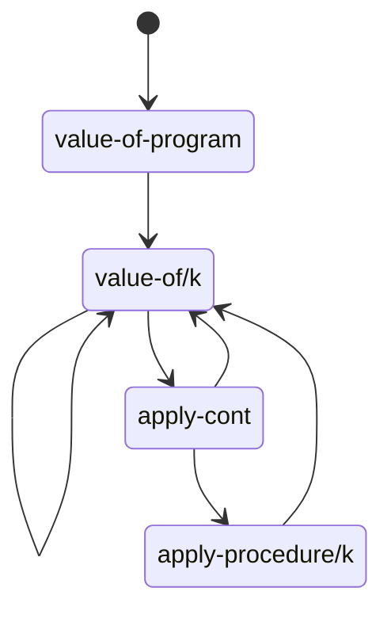

# EOPL

书籍《Essentials of Programming Language》使用 Scheme 实现了类似 Lisp 的语言用来解释语言设计中的一些核心概念。

本仓库使用 Racket 重新实现相关代码，Racket 有现成的库提供了 [EOPL](https://docs.racket-lang.org/eopl/index.html) 中使用的语法形式和函数。

使用 raco 命令安装 [EOPL 库](https://github.com/racket/eopl)，并在.rkt 文件第一行使用 `#lang eopl`开启这个模式。

```rkt
#lang eopl
```
EOPL 中使用 Scheme 的函数`identifier?`判断一个值是不是标识符，Racket 没有提供这个函数，但是有类似`symbol?`来判断一个值是不是符号，区别参考这个[问题](https://stackoverflow.com/questions/48393025/difference-between-an-identifier-and-symbol-in-scheme)。

## TODO:

- proc-lang free-variables optimization
  - [ ] at branch feat/free-variables
  - [ ] Exercise 3.42 with lexical addressing
- chapter 5.1
  - [ ] Exercise 5.16 在 Exercise 4.22的基础上，实现CPS解释器。


## Chapter 3

source language/defined language 指要设计和实现的语言。
implementation language/defining language 指编写源码使用的语言。
expressed values 指原语言中可能的表达式值类型
denoted values 指实现语言中用来表示 expressed values 的值

在对源语言进行解释执行的过程中，要识别 expressed values 的类型，然后映射到 denoted values，在实现语言中对 denoted values 进行
相应的运算，然后将运算结果包装为对应的 expressed values，映射回源语言。

$n$ 是 denoted value，$\lceil n \rceil$ 代表 expressed value 中对应的值。

$n$ 是 expressed value，$\lfloor n \rfloor$ 代表 denoted value 中对应的值。

### let-lang

**let 语句** 定义的若干个变量中，前边的变量对后续变量的初始化语句不可见，变量初始化语句不能使用 let 中定义的变量，只能使用外层变量。

```rkt
let x = 30
    in let x = -(x,1)
           y = -(x,2)
        in -(x,y)
```

`y = -(x,1)`中的`x`是外层的`x`，所以结果是`1`。

**`let*`**语句定义的若干个变量中，前边的变量对后续变量的初始化语句可见。

```rkt
let x = 30
    in let* x = -(x,1)
            y = -(x,2)
        in -(x,y)
```

`y = -(x,1)`中的`x`是内层的`x`，所以结果是`1`。

**unpack**类似于 ES 6 的解构，将一个列表中的元素绑定绑定到多个变量上。

```
let u = 7
    in unpack x y = cons(u,cons(3,emptylist))
        in -(x,y)
```

计算结果是`4`。

### proc-lang

### letrec lang

#### env-list rep

letrec-lang 中环境使用 list 实现，参考标签: letrec-lang-env-list-env.

### lexical addressing

词法作用规则下，变量使用处与定义处相隔的环境层数与代码结构对应，这个偏移量在运行前就确定了。因此可以提前计算，并将变量使用处名称替换为
偏移量，这样就避免了在运行时再去逐层查找变量，可以变量查找从线性时间优化为常量时间。

最基本的情况中，每层环境（Environment）只定义一个变量数据，变量的就可以替换为一个非负整数偏移量，0 表示当前层环境；如果每层环境（Environment）
可以定义多个变量数据，那么变量可以由一个非负整数对定义`(env, offset)`，`env`代表环境的偏移量，`offset`表示环境中单个变量的偏移量。

为了实现 lexical addressing，需要对解释器进行改造，拆分为两个步骤。

第一步翻译，将源代码分析一遍，将涉及到的变量定义与使用的表达式类型`E`转换为一个新的对应类型表达式类型`E1`。`E`中的变量引用在`E1`中被替换为偏移量数据，`E`中的变量定义名称信息在`E1`中可以不再记录，因为在运行时已经不需要名称信息再去定位变量了。

第二步改造解释器，解释器中去除对于旧类型`E`的支持，因为翻译的过程中所有表达式类型`E`都被转换处理，结果中没有这种类型了；增加对于新类型`E1`的支持，`E1`的运行结果应该和旧解释其中`E`一致。

具体涉及到的修改：

1. 定义 static-env 在转换过程中用来计算变量偏移量。
1. 运行时的 env 可以去除变量名称信息，只记录变量值。
1. 涉及到变量定义和使用的表达式类型`E`需要增加对应新类型`E1`，其他的表达式类型只需要递归转换即可。当前版本涉及的表达式类型如下:
   1. var-exp -> nameless-var-exp
   1. let-exp -> nameless-let-exp
   1. proc-exp -> nameless-proc-exp

## Chapter 4

### explicit refs lang

新增三个语句进行引用相关操作

1. `newref(x)` 创建新引用
1. `deref(x)` 读取引用的值
1. `setref(x, val)` 更新引用值

这三个语句中的引用`x`也可以是表达式，所以可以使用引用的引用，需要定义新的表达式引用值类型`ref-val`。

```rkt
(expression ("newref" "(" expression ")") newref-exp)
(expression ("deref" "(" expression ")") deref-exp)
(expression ("setref" "(" expression "," expression")") setref-exp)
```

当前代码使用`list`来存储所有的引用值，这个`list`是全局共享的。由于使用了`list`的数据结构，引用的创建时间复杂度是 O(1)，引用
的读取和更新是 O(N)。

`setref`语句的效果在于更新引用值这个副作用（effect），所以表达式的返回值没有作用，可以根据需要任意选取。

### implicit refs

隐式的引用变量语言中，默认所有变量保存的都是引用，引用的创建、读取、更新由语言本身进行处理，不需要显式的语法。
对`environment`做更新，每个变量保存的值都是非负整数值代表的引用值（练习题 4.15），没有必要再使用`ref-val`类型。

1. 对变量定义的表达式进行处理，自动调用生成新引用。
   1. `let`定义了新变量
   1. `letrec`定义了新的函数值变量
   1. `call-exp`调用时函数参数也定义了新的变量
1. 引用的更新，增加了`assign-exp(var, exp)`语句，首先获取变量`var`保存的引用值，然后更新引用指向的数据为`exp`的值。
1. 引用的读取，`var-exp(var)`，读取变量`var`的引用值，然后获取引用指向的数据。

### letmutable

混合使用 let 和 mut

### ref-exp

在 explicit-refs 中使用`newref(expression)`形式生成引用，其中允许任意形式的表达式，因此可以生成引用的引用，
引用值是该语言的 expressed value。

使用 ref 表达式`ref id`形式，可以在 call-by-value 机制的语言中，达到 call-by-reference 的效果，引用值是语言的 denoted value，因此在目标语言中是无法获取引用值的，`ref`只能使用到变量名上，因此也无法形成引用的引用。

这一点类似于 JS 中的语言规范中的 [The Reference Specification Type](https://262.ecma-international.org/6.0/#sec-reference-specification-type) 类型。

### arrayref

在`call-by-reference`的基础上实现数组类型，将数据类型当做引用处理，这样`arrayref`可以通过`swap`交换数组元素。

```
let swap = proc (x, y)
            let temp = x
              in begin
                  set x = y;
                  set y = temp
                  end
    set3 = proc (x) set x = 3
    set4 = proc (x) set x = 4
      in let a = newarray(2, -99)
          in begin
            (set3 arrayref(a, 0));
            (set4 arrayref(a, 1));
            (swap arrayref(a, 0) arrayref(a, 1));
            -(arrayref(a, 0), arrayref(a, 1))
          end
```

上面的代码中关键句是`(swap arrayref(a, 0) arrayref(a, 1))`，为了实现数组元素交换，关键在于`arrayref(a, 0)`表达式
作为函数调用的参数时，应该按照引用传参，需要在`value-of-operands`函数中增加对`arrayref-exp`类型的处理。

```
(define (value-of-operands operands env)
  (map (lambda (operand)
         (cases expression operand
           (var-exp (var) (apply-env env var))
           (arrayref-exp (var exp1)
                         (let ((ref (apply-env env var)) (val1 (value-of-exp exp1 env)))
                           (let ((offset (expval->num val1)))
                             (arrayref ref offset)
                             )
                           )
                         )
           (else (newref (value-of-exp operand env)))
           )
         ) operands)
  )
```

同时在`swap`函数内部，`let temp = x`语句的效果因该是`temp`和`x`是指向同一个值的引用，否则当前实现中`temp`的值是指向引用的引用，
没有实际意义。

需要修改的代码是

```
(define (vals->refs vals)
  (map (lambda (val)
         (if (reference? val)
             val
             (newref val)
             )
         ) vals)
  )
```

此外`arrayref(a, 0)`在不作为函数参数时，得到的值是数组下标对应的元素，而不是引用，这样最后一个表达式才能计算正确。

```
-(arrayref(a, 0), arrayref(a, 1))
```

### call-by-value-result

这是`call-by-reference`的一个变种，实现的效果也是函数的执行会对传入的数据产生副作用。
在`call-by-value`的基础上，函数调用传入参数时，所有参数值生成新的引用值，执行函数内部操作，在函数运行结束后将
变量类型的参数，使用对应下标引用值指向的数据`result`更新拷贝到变量引用指向的数据。

```rkt
let a = 1
  in let b = proc (x) setref(x, 3)
    in begin
      (b a);
      a
    end
```

函数`b`执行时`x`被更新为`3`，函数调用完成后，将`x`的结果值`3`复制到变量`a`引用的数据，达到了函数调用修改`a`的效果。
这种方式相比于`call-by-reference`可能有性能优势，因为利用了内存局部性（memory locality）。

### call-by-name/call-by-need

`call-by-name`对函数调用的实参进行惰性求值，保存实参表达式和对应的环境`environment`，在后续读取操作发生时进行运算求值。

```racket
letrec infinite-loop (x) = (infinite-loop -(x,-1))
  in let f = proc (z) 11
    in (f (infinite-loop 0))
```

代码中`infinite-loop`是一个无限递归的函数，正常求值策略下调用会产生死循环。在惰性求值策略下，`(f (infinite-loop 0))`中实参`(infinite-loop 0)`被
包装为`thunk`，不会立即求值，并且由于函数`f`中没有读取变量`z`，所以函数`thunk`不会被求值，因此不会形成死循环。

惰性求值表达式的值**被思考**（thunk）过，因为被称为 thunk，也称这种状态函数参数被冻结（frozen），后续`thunk`被求值称为 thawed，或者使用主动的说法 force。

惰性求值策略可以表达**无限递归**的数据结构。

在没有副作用的情况下，立即求值和惰性求值的结果是相同的；在有副作用的情况下，创建 thunk 后到 thunk 被求值的这段过程中，环境变量可能由于副作用发生改变，立即求值和
惰性求值得到的结果不相同，因此副作用和惰性求值同时存在时，程序的结果会出现意料以外的行为，因此惰性求值策略一般在没有副作用的函数式编程语言中使用。

没有副作用的替换求值策略称为 β-reduction。

`call-by-need`对 thunk 求值进行缓存，这样每个 thunk 只会进行一次求值，如果 thunk 的求值过程有副作用，那么这两种策略结果并不相同。

对于数字、字符串字面量等运行前就可以确定值的常量表达式，惰性求值策略可以不用生成 thunk。

## Chapter 5

观察阶乘函数`fact`递归的执行情况情况，每一次`(fact (-n 1))`的递归调用出现在函数参数位置（operand position），整个计算过程中每次递归调用都会加深调用栈，上一层栈中记录了参数`n`，这样才能在子函数返回时继续计算（recursive control behavior）。

```
(define fact
            (lambda (n)
(if (zero? n) 1 (* n (fact (- n 1))))))
```

```
(fact 4)
= (* 4 (fact 3))
= (* 4 (* 3 (fact 2)))
= (* 4 (* 3 (* 2 (fact 1))))
= (* 4 (* 3 (* 2 (* 1 (fact 0)))))
= (* 4 (* 3 (* 2 (* 1 1))))
= (* 4 (* 3 (* 2 1)))
= (* 4 (* 3 2))
= (* 4 6)
= 24
```

观察第二个版本的阶乘函数`fact-iter`调用，递归函数调用不在函数参数位置，而在尾调用位置（tail position），递归子调用值也是整个函数的返回值，
因此递归调用可以不增加栈深度（iterative control behavior）。

```
(define fact-iter
    (lambda (n)
      (fact-iter-acc n 1)))
  (define fact-iter-acc
    (lambda (n a)
(if (zero? n) a (fact-iter-acc (- n 1) (* n a)))))
```

```
(fact-iter 4)
= (fact-iter-acc 4 1)
= (fact-iter-acc 3 4)
= (fact-iter-acc 2 12)
= (fact-iter-acc 1 24)
= (fact-iter-acc 0 24)
= 24
```

是函数参数的求值而不是函数调用本身使得控制上下文增加。

> It is evaluation of operands, not the calling of procedures, that makes the control context grow.

尾递归调用中，子调用使用父调用的 Continuation，尾递归不会增加 Continuation。

尾递归调用空间复杂度是 O(1)，`fact`空间复杂度是 O(N)

Continuation 的作用和调用栈 stack 一样，记录着程序运行的控制上下文，一个 Continuation 等价于一个栈帧（frame）或者激活记录（activation record）。

## 5.1 A Continuation-Passing Interpreter

在`src/ch5`下总共有四个版本的实现

1. letrec-lang 是用普通数据结构代表Continuation的实现，函数调用使用了值传递（call by value）。
1. call-by-ref 是在letrec-lang的基础上，函数调用使用了引用传递（call by reference）的版本。
1. continuation-as-lambda 使用了原生`lambda`函数来代表Continuation的实现，函数调用使用了值传递（call by value）。
1. continuation-as-list 是使用了`list`来代表Continuation的实现，`list`的每个元素代表一个表达式的求值过程，等同于栈帧（stack frame），空`list`代表`end-cont`，也就是整个程序的最后运算。函数调用使用了值传递（call by value）。

CPS解释器的实现核心思路如下，

整个程序有个初始的`end-cont`代表程序结束运算时的回调。对不同表达式分类处理，每类表达式分成若干个计算步骤，每个步骤进行时递归的调用`value-of/k`计算当前步骤的表达式`exp1`，并且将之前的`cont`拼接当前表达式`exp1`求值后应该进行的操作，形成新的`cont1`，`cont1`被回调时拿到了`exp1`的值，进行相应计算得到结果，并用于调用`cont`。每一步计算都形成新的`cont`嵌套了旧的`cont`，`end-cont`被嵌套在最内层，效果等价于调用栈增长。

letrec-lang/continuation-as-lambda的实现中，`cont`的数据都是嵌套的；continuation-as-list稍有不同，将每帧拆分开，使用线性的结构表示。

需要注意的是`let-exp/call-exp/begin-exp/list-exp`这几个要对若干表达式顺序求值的情况，统一使用了`value-of-exps/k`进行处理。

## 5.2 Trampoline Interpreter

5.1 中的CPS解释器执行时，函数递归调用，调用栈不断增长，在过程式语言中会造成栈溢出错误，可以使用蹦床（trampoline）的技巧来解决这个问题。

修改`apply-procedure/k`使其返回一个代表了后续运算的值`thunk`中，这样在`apply-procedure/k`返回时，递归函数调用栈会被弹出，将返回值逐层向上传递直到最顶层，效果是将`apply-procedure/k`所代表的后续运算存储`thunk`起来，然后在顶层使用`trampoline`函数重新激活`thunk`继续之前运算，就像蹦床一样，当`trampoline`得到的值不是`thunk`，而是一个值，就得到了最终的运算结果。



根据程序中递归的解释器递归调用关系图（忽略了`value-of-exps/k`），`apply-procedure/k`返回`thunk`，确定几个函数的返回值类型。

```
apply-procedure/k -> thunk
value-of/k -> bounce
apply-cont -> bounce
bounce = expval | thunk
```

ch5/trampoline/bounce.rkt中`apply-procedure/k`返回参数为空的函数包裹原来的函数体，使用函数表示实现`thunk`。

```racket
(define (create-bounced-apply-procedure/k apply-procedure/k)
  ; apply-procedure/k
  (lambda (value-of/k proc1 args saved-cont)
    (lambda ()
      (apply-procedure/k value-of/k proc1 args saved-cont)
      )
    )
  )
```

ch5/trampoline/bounce-ds.rkt中`apply-procedure/k`返回一个数据结构`a-bounce`表示`thunk`。

```racket
(define (create-bounced-apply-procedure/k apply-procedure/k)
  ; apply-procedure/k
  (lambda (value-of/k proc1 args saved-cont)
    (a-bounce apply-procedure/k value-of/k proc1 args saved-cont)
    )
  )
```

在函数入口位置需要使用蹦床函数`trampoline`重新激活`thunk`。

```racket
(define (trampoline bounce)
  (if (expval? bounce)
    ; 如果得到了结果值，直接返回
    bounce
    ; 激活蹦床函数，继续执行运算
    (trampoline (apply-bounce bounce))
  )
)
```

上述蹦床函数的实现能消除`value-of/k`/`apply-cont`/`apply-procedure/k`递归调用的栈溢出问题，但是还有两个问题。

一个问题是实现假设了解释器运行中在一个有限的时间内必定会调用到`apply-procedure/k`，从而不触发栈溢出问题（Page 157）。

> For example, we can insert a (lambda () ...) around the body of apply-procedure/k,
> since in our language no expression would run more than a bounded amount of time without performing a procedure call.

但是这个假设并不严格，对于不包含函数调用的表达式，例如`-(a,b)`，如果嵌套层数非常多，`value-of/k`/`apply-cont`的递归调用也能造成调用栈很深，从而触发栈溢出问题。
为了完全避免栈溢出，需要在每个递归调用处，应用`thunk`的技巧。

另外一个问题是返回`thunk`消除了`value-of/k`/`apply-cont`/`apply-procedure/k`造成的栈无限增长，但是`trampoline`函数本身也是递归调用的，也可能造成栈无限增长。
可以通过将`trampoline`函数从递归形式改写为循环来解决这个问题（Exercise 5.21）。

参考代码ch5/trampoline.rkt中`trampoline-loop`实现。

```racket
(define (trampoline-loop bounce)
  (do ([val bounce (apply-bounce val)])
    ((expval? val) val)
    )
  )
```

另外还可以通过**抛出异常**的方式弹出函数栈，在程序入口捕捉异常，重新激活运算。
